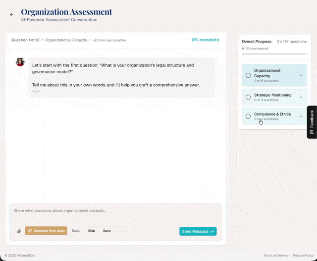

# contextual-feedback

Drop-in feedback for React apps where users click the exact section they're talking about. An AI agent triages, acts, and resolves — turning feedback into a self-healing loop.

**The problem:** Generic feedback widgets collect vague complaints with no context. You get "the pricing is confusing" with no idea which part. Then it sits in a backlog nobody reads.

**This library fixes both sides:** users target specific sections, and an AI agent closes the loop automatically.

<p align="center">
  
</p>

## How It Works

```
1. User clicks a section  →  feedback + context auto-attached
2. TRIAGE endpoint        →  returns pending items in AI-optimized format
3. Your AI agent reads    →  decides action (fix, reply, reject)
4. RESOLVE endpoint       →  bulk-updates items with status + notes
```

A user reports "this price is wrong" on your Pricing Table. Your AI agent picks it up, checks the data, deploys a fix, and marks it resolved. No human in the loop unless you want one.

## Quick Start

```bash
npm install contextual-feedback
```

### 1. Set up the database

**Supabase:**
```ts
import { SUPABASE_SETUP_SQL } from 'contextual-feedback/setup';
console.log(SUPABASE_SETUP_SQL);
// Run this in your Supabase SQL editor
```

**Postgres:**
```ts
import { POSTGRES_SCHEMA } from 'contextual-feedback/adapters/postgres';
// Run POSTGRES_SCHEMA against your database
```

**No database (development):**
```ts
import { createMemoryAdapter } from 'contextual-feedback/adapters/memory';
const adapter = createMemoryAdapter();
// In-memory store, resets on restart
```

### 2. Create the API route

```ts
// app/api/feedback/route.ts (Next.js App Router)
import { createApiHandlers } from 'contextual-feedback/api';
import { createSupabaseAdapter } from 'contextual-feedback/adapters/supabase';
import { createClient } from '@supabase/supabase-js';

const supabase = createClient(process.env.SUPABASE_URL!, process.env.SUPABASE_KEY!);
const adapter = createSupabaseAdapter({ client: supabase });

const handlers = createApiHandlers({
  adapter,
  getUserEmail: async (request) => request.headers.get('x-user-email'),
});

export const GET = handlers.GET;
export const POST = handlers.POST;
```

For admin endpoints (triage, resolve, status updates), wire up additional routes:

```ts
// app/api/feedback/triage/route.ts
export const GET = handlers.TRIAGE;

// app/api/feedback/resolve/route.ts
export const POST = handlers.RESOLVE;

// app/api/feedback/[id]/route.ts
export async function PATCH(request: Request, { params }: { params: { id: string } }) {
  return handlers.PATCH(request, params.id);
}

// app/api/feedback/count/route.ts
export const GET = handlers.COUNT;
```

### 3. Add the UI

```tsx
import { FeedbackProvider, FeedbackButton } from 'contextual-feedback';
import 'contextual-feedback/styles.css';

export default function Layout({ children }) {
  return (
    <FeedbackProvider>
      {children}
      <FeedbackButton />
    </FeedbackProvider>
  );
}
```

### 4. Mark sections as targetable

```tsx
<section data-feedback-context="Pricing Table" data-feedback-id="pricing">
  {/* Users see this highlighted when feedback mode is active */}
</section>

<section data-feedback-context="Feature Comparison" data-feedback-id="features">
  {/* Each section gets its own highlight + click target */}
</section>
```

When users click the feedback button, all marked sections glow blue. They click one, and the section name + element ID are auto-attached to their feedback. Press ESC to exit feedback mode. A "General Feedback" button also appears for page-level comments.

## AI Agent Integration

The library is designed to sit inside an AI agent loop. Here's the full cycle:

### 1. Triage — get pending feedback

```ts
const res = await fetch('/api/feedback/triage');
const { items, summary } = await res.json();
// items: [{ id, feedback, page, section, category, from, status, submittedAt }]
// summary: { pending: 3, inReview: 1, total: 4 }
```

### 2. Format for AI context

```ts
import { formatForAI } from 'contextual-feedback/ai';

const feedback = await adapter.getAll('Pending');
const markdown = formatForAI(feedback);
// Returns structured markdown ready to inject into an AI prompt
```

Output looks like:
```
## Feedback Triage (2 items)

### 1. [Pending] Pricing Table — /pricing
> The enterprise price shows $99 but the checkout says $149
- From: user@example.com
- ID: abc-123
- Category: bug

### 2. [Pending] General — /dashboard
> Would love a dark mode option
- From: another@example.com
- ID: def-456
- Category: feature
```

### 3. Resolve — close the loop

```ts
await fetch('/api/feedback/resolve', {
  method: 'POST',
  body: JSON.stringify({
    resolutions: [
      { id: 'abc-123', status: 'Done', adminNotes: 'Fixed pricing mismatch in commit abc123' },
      { id: 'def-456', status: 'Rejected', adminNotes: 'Dark mode planned for Q3' },
    ],
  }),
});
```

## Authorization

Admin endpoints (PATCH, TRIAGE, RESOLVE) can be gated:

```ts
const handlers = createApiHandlers({
  adapter,
  authorize: async (request) => {
    const session = await getServerSession(request);
    return session?.user?.role === 'admin';
  },
});
```

GET, POST, and COUNT are open by default. If `authorize` is not provided, all endpoints are unrestricted.

## Categories

Feedback can be categorized: `bug`, `feature`, `praise`, `question`, `other`.

```ts
await fetch('/api/feedback', {
  method: 'POST',
  body: JSON.stringify({
    feedbackText: 'Login button is broken',
    pageUrl: '/login',
    category: 'bug',
  }),
});
```

## Components

### `<FeedbackProvider>`

Wraps your app. Renders the dialog and hover handler automatically.

| Prop | Type | Default | Description |
|------|------|---------|-------------|
| `apiEndpoint` | `string` | `'/api/feedback'` | API endpoint for submissions |
| `onSubmit` | `(feedback) => Promise<void>` | — | Custom submit handler (bypasses API) |
| `DialogComponent` | `React.ComponentType` | Built-in dialog | Replace the feedback dialog entirely |

### `<FeedbackButton>`

Floating button to enter/exit feedback mode.

| Prop | Type | Default | Description |
|------|------|---------|-------------|
| `position` | `'right' \| 'left' \| 'bottom-right' \| 'bottom-left'` | `'right'` | Screen position |
| `className` | `string` | — | Additional CSS class |

### `<FeedbackList>`

Admin component for viewing and managing feedback.

| Prop | Type | Default | Description |
|------|------|---------|-------------|
| `initialFeedback` | `Feedback[]` | — | Server-side initial data |
| `apiEndpoint` | `string` | `'/api/feedback'` | API endpoint |
| `fetchOnMount` | `boolean` | `true` (if no initialFeedback) | Auto-fetch on mount |
| `statusFilter` | `FeedbackStatus` | — | Filter by status |
| `onStatusChange` | `(id, status) => Promise<void>` | — | Custom status change handler |
| `pageSize` | `number` | `20` | Items per page |
| `showCopyButtons` | `boolean` | `true` | Show copy-to-clipboard buttons |
| `exportFormat` | `'default' \| 'ai-triage'` | `'default'` | JSON export format |
| `dateLocale` | `string` | `'en-US'` | Date formatting locale |
| `className` | `string` | — | Container CSS class |

### `useFeedback()` Hook

Access feedback state from any component inside the provider.

```tsx
const {
  isFeedbackMode,      // Whether section targeting is active
  toggleFeedbackMode,  // Toggle section targeting on/off
  openDialog,          // Open dialog with optional context
  openFeedbackDialog,  // Open dialog without context
  closeDialog,         // Close the dialog
  isOpen,              // Whether the dialog is open
  context,             // Current section context
  elementId,           // Current element ID
} = useFeedback();
```

## Utilities

### `detectFeedbackContext()`

Auto-detect which section the user is viewing. Checks URL hash first, then finds the topmost visible `data-feedback-context` element.

```ts
import { detectFeedbackContext } from 'contextual-feedback';
const { context, elementId } = detectFeedbackContext();
```

### `getPageContexts()`

List all feedback-targetable sections on the current page.

```ts
import { getPageContexts } from 'contextual-feedback';
const sections = getPageContexts();
// ['General Page', 'Feature Comparison', 'Pricing Table']
```

## Database Adapters

| Adapter | Import | Use case |
|---------|--------|----------|
| Supabase | `contextual-feedback/adapters/supabase` | Production with Supabase |
| PostgreSQL | `contextual-feedback/adapters/postgres` | Any Postgres database |
| Memory | `contextual-feedback/adapters/memory` | Development and testing |

Implement the `FeedbackAdapter` interface for custom storage:

```ts
import type { FeedbackAdapter } from 'contextual-feedback';

const myAdapter: FeedbackAdapter = {
  getAll: async (status?) => { /* ... */ },
  getById: async (id) => { /* ... */ },
  add: async (input) => { /* ... */ },
  update: async (id, updates) => { /* ... */ },
  delete: async (id) => { /* ... */ },         // optional
  getCount: async (status?) => { /* ... */ },   // optional
  bulkUpdate: async (updates) => { /* ... */ }, // optional
};
```

## Schema

| Column | Type | Default | Description |
|--------|------|---------|-------------|
| id | UUID | `gen_random_uuid()` | Primary key |
| user_email | VARCHAR(255) | — | Submitter email |
| page_url | VARCHAR(2000) | — | Page where feedback was given |
| feedback_text | TEXT | — | The feedback content |
| status | VARCHAR(50) | `'Pending'` | `Pending`, `In Review`, `Done`, `Rejected` |
| category | VARCHAR(50) | NULL | `bug`, `feature`, `praise`, `question`, `other` |
| context | VARCHAR(255) | NULL | Section name from `data-feedback-context` |
| element_id | VARCHAR(255) | NULL | Element ID from `data-feedback-id` |
| admin_notes | TEXT | NULL | Agent/admin resolution notes |
| resolved_at | TIMESTAMPTZ | NULL | Auto-set when status becomes Done/Rejected |
| created_at | TIMESTAMPTZ | `NOW()` | Submission timestamp |
| updated_at | TIMESTAMPTZ | `NOW()` | Auto-updated via trigger |

### Row Level Security (Supabase)

```ts
import { SUPABASE_RLS_SQL } from 'contextual-feedback/setup';
// Run in SQL editor — enables RLS with admin/user policies
```

Requires a `user_profiles` table with `id` (matches `auth.uid()`) and `role` columns.

## Styling

```tsx
import 'contextual-feedback/styles.css';
```

All classes prefixed with `cf-`. Override any class or copy the stylesheet to customize.

## Requirements

- React 18+
- Works with Next.js App Router (other frameworks with standard fetch-based API routes)
- Supabase, PostgreSQL, or any custom adapter

## License

MIT
